# Pilot Evidence
This section shows selected scenarios from a user's perspective along with the underlying NPP communication. 

## 1. Place Information Look-up by Service Provider
### Scenario: Occupancy Data Retrieval by Parkopedia
**Parkopedia** provide parking location related information on their website (see screenshot below) and in their mobile app:
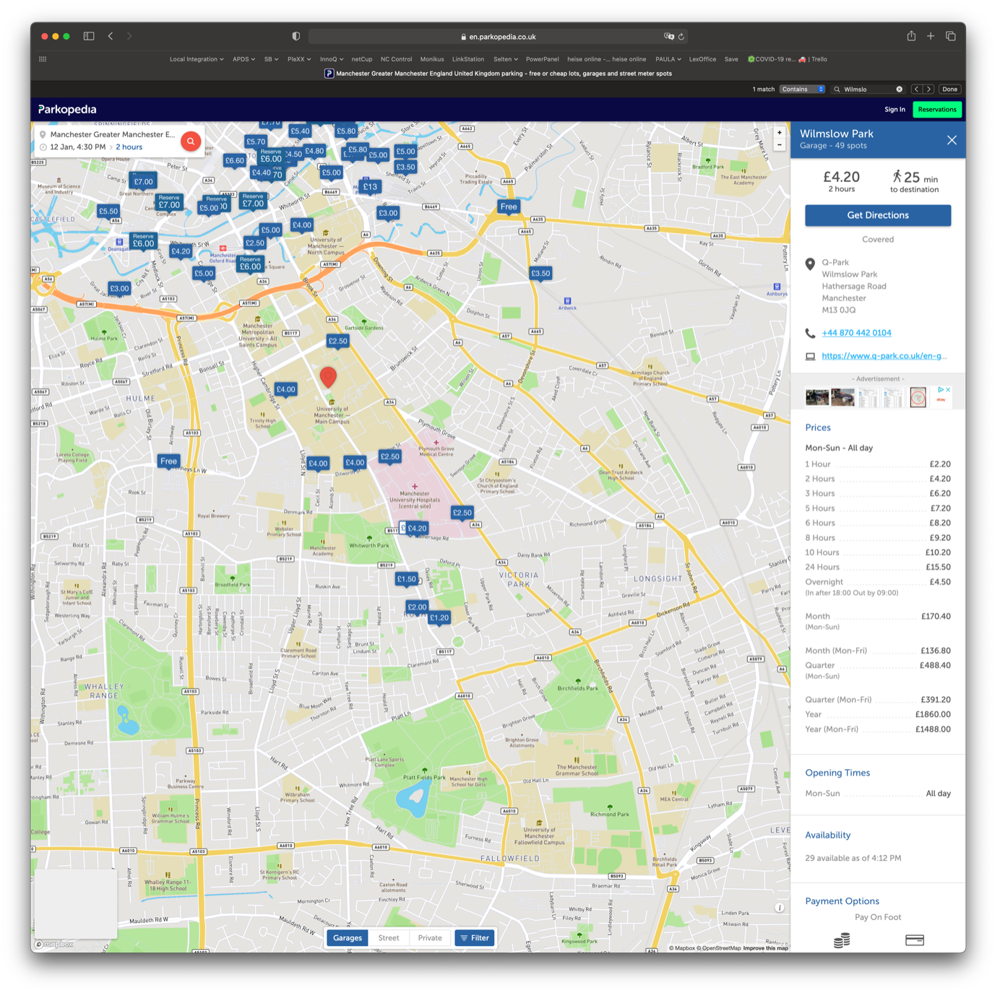

Information about the car parks capacity and current space availability is provided by the platform pilot system (for participating locations).

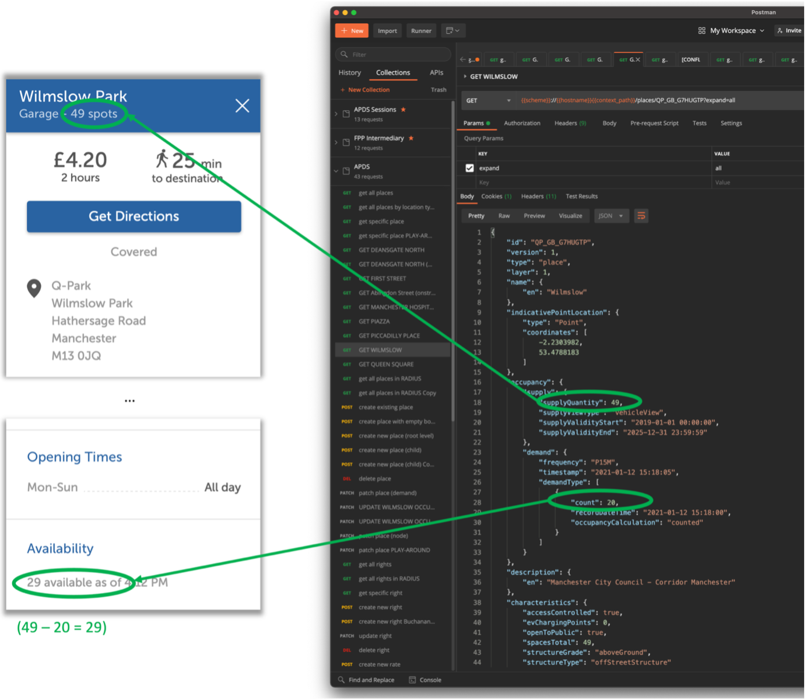

To the left, you see a zoom-in into the details provided on _Parkopedia_'s website.
On the right, you see the underlying NPP API request/response.

## 2. Pay-on-Arrival Session Example: Ringgo
### Scenario: End User purchases Parking Session from Ringgo
#### Purchase Process
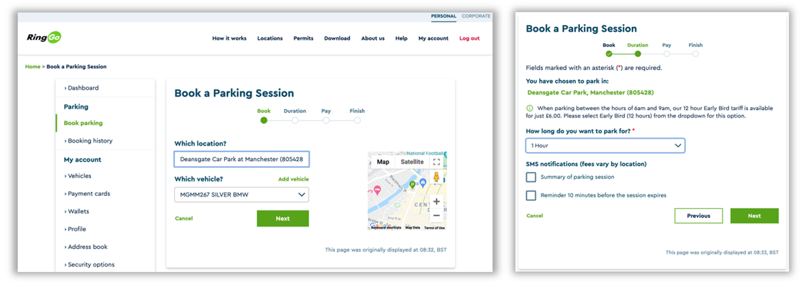
On the provider's website, the customer selects location, vehicle and duration.

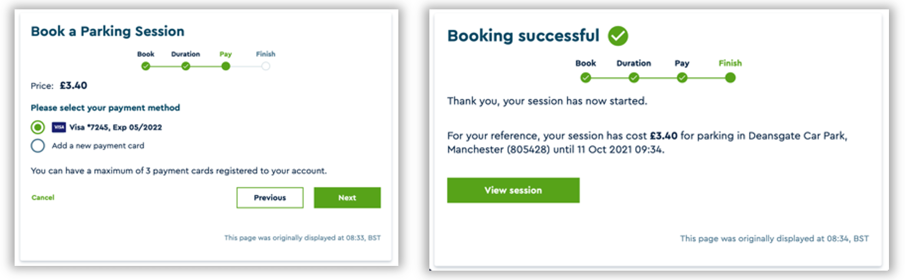
On the provider's website, the customer pays for the requested parking right.

The customer now has an active parking session.

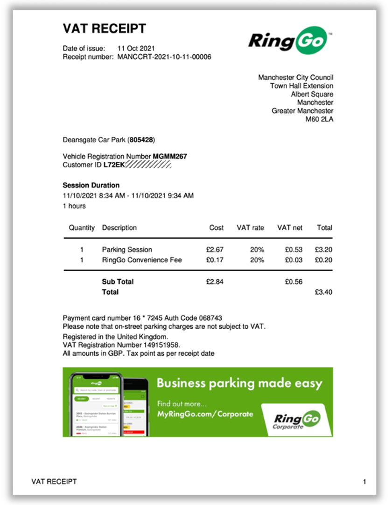
A corresponding receipt is issued by the service provider.

The service provider sends all session details to the NPP.

#### Logging Database Extract
The following is an extract from the NPP's logging database showing the details exchanged:
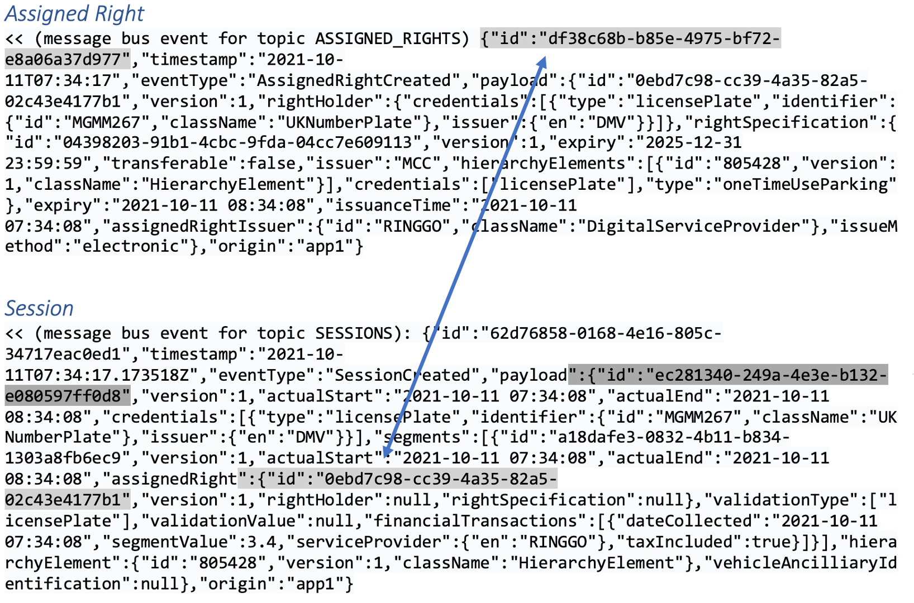

#### Verification on NPP
The NPP is mostly a backend system talking to other machines only ("headless" system). The only exception is a web application named _Session Viewer_ that allows authorised users to look up session information for verification purposes (e.g. in case of a challenged PCN). The screenshots below were taken from said _Session Viewer_ application.

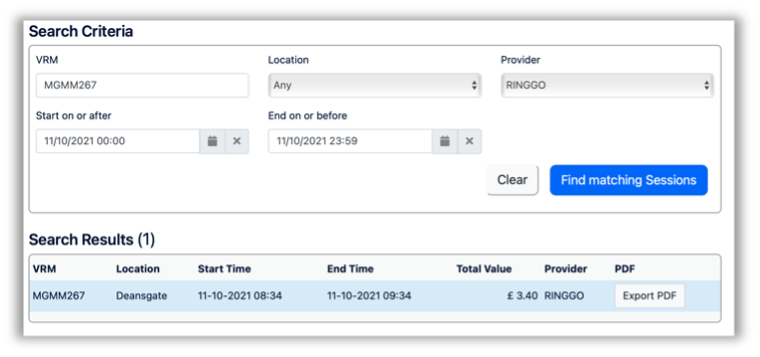

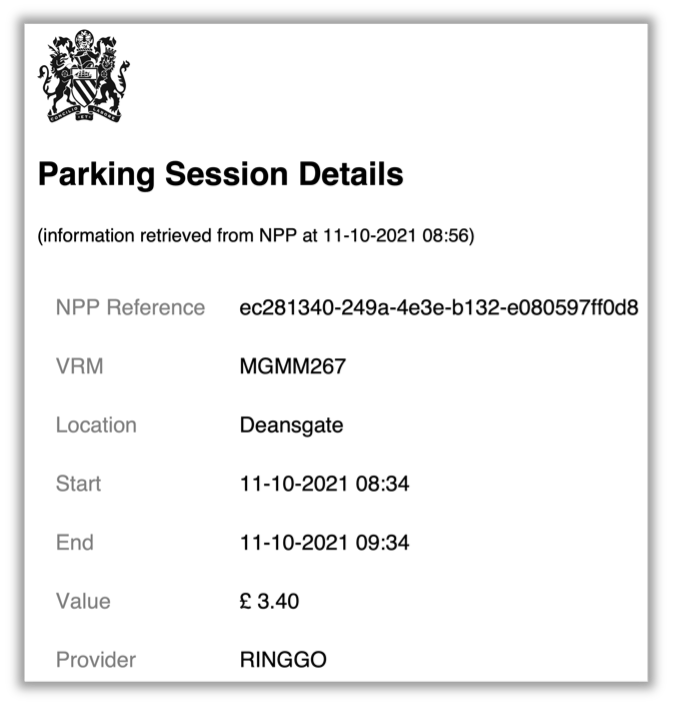

## 3. Enforcement Information
### Scenario: Envorcement Service Provider checks for Sessions on the Platform
#### Step 1: Customer purchases a Parking Session from the Service Provider
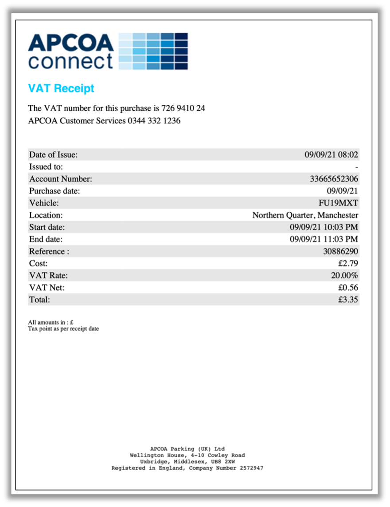

#### Step 2: Service Provider sends Session Details to NPP
The following is an extract from the NPP's logging database showing the details exchanged:
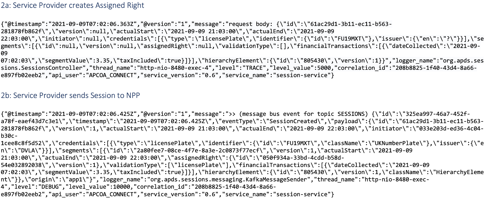

#### Step 3: Enforcement Service Provider checks Session via Handheld Device
**Step 3a: query NPP**
The following is an extract from the NPP's logging database showing the details exchanged:
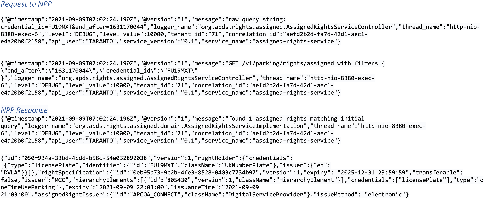

**Step 3b: received Information displayed on Handheld Unit**
The information received from the NPP is then displayed on the enforcement officer's handheld device:
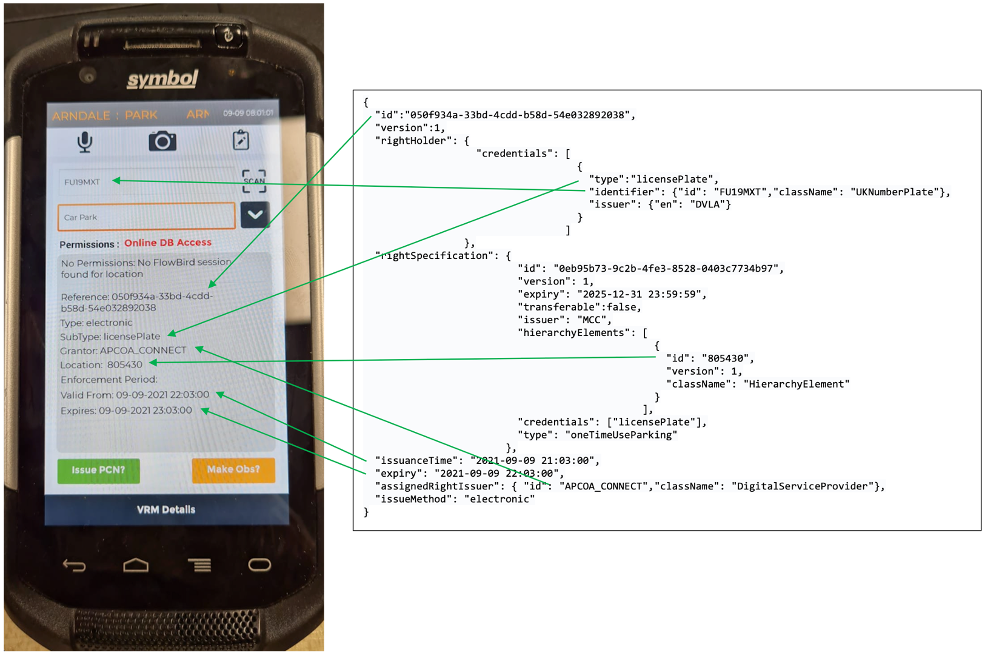

