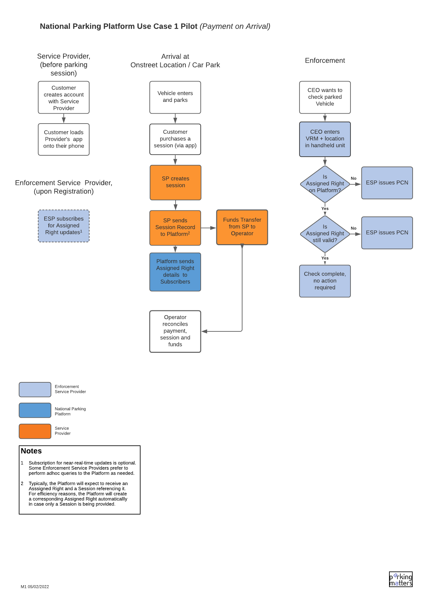
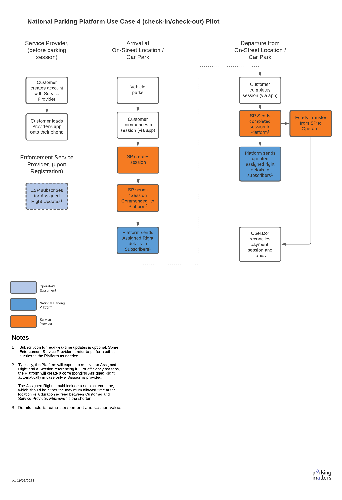
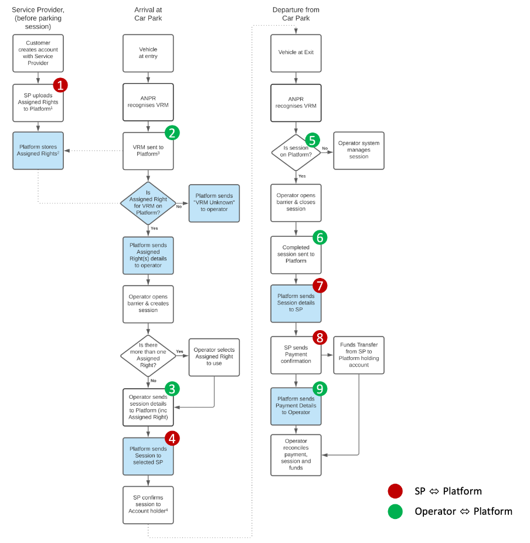
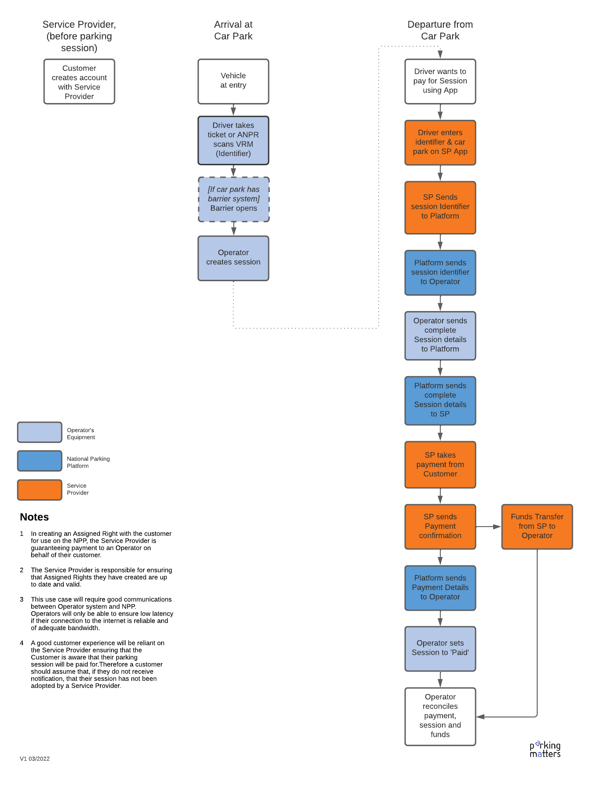

This document provides a translation of typical use cases into concrete dialogue sequences. It is meant to provide guidance to APDS adopters on their way to become NPP users.

## Use Case 1: Parking Availability

### Overview


### Overview of engaged Endpoints

#### 1. SP queries the Platform for available Parking Locations
<span style="color: red; font-size: 22px">&#x278A;</span> **`SP` &rarr; `Platform`**

The following request finds parking locations within a 1000 metres radius of a particular point:
``` 
GET /v1/parking/places?latitude=53.4806&longitude=-2.2428&radius=1000&expand=all
```

#### 2. SP queries the Platform for a Location's Tariffs/Rates
<span style="color: red; font-size: 22px">&#x278B;</span> **`SP` &rarr; `Platform`**

The following request first reads right specification / eligibility information about a particular location and then retrieves the corresponding tariff information.
```
// step 1: get right specification
GET /v1/parking/rights/{rightSpecificationIdForSelectedPlace}?expand=all

// step 3: get rate details
GET /v1/parking/rates/{rateId from previous request}?expand=all

```

#### 3. SP queries the Platform for current Space Availability
<span style="color: red; font-size: 22px">&#x278C;</span> **`SP` &rarr; `Platform`**

Current space availability information is retrieved via the _occupancy_ filter of the _/places_ endpoint:
```
GET /v1/parking/places/{placeId}?expand=occupancy

```

#### 4. DATA PROVIDER sends Space Availability Update to the Platform
<span style="color: red; font-size: 22px">&#x278D;</span> **`DP` &rarr; `Platform`**

Current space availability information is sent to the _/places_ endpoint:
```
PATCH /v1/parking/places/{placeId}

```
_(the PATCH method only updates provided information and leaves everything else unchanged)_

### Detailed Request/Response Examples

#### 1. SP queries the Platform for available Parking Locations

Request: `GET /v1/parking/places?location_type=off_street`

Response: `HTTP/1.1 200 OK`

Payload: 

```json
{
    "meta": {
        "referenceInstant": 1686889399,
        "offset": 0,
        "pageSize": 200,
        "total": 9
    },
    "data": [
        {
            "id": "QP_GB_G7HRF7Y",
            "version": 1,
            "type": "place",
            "layer": 1,
            "name": {
                "en": "Piazza"
            },
            "indicativePointLocation": {
                "type": "Point",
                "coordinates": [
                    -2.2412945,
                    53.4776558
                ]
            },
            "occupancy": {
                "supply": {
                    "supplyQuantity": 225,
                    "supplyViewType": "vehicleView",
                    "supplyValidityStart": "2019-01-01 00:00:00",
                    "supplyValidityEnd": "2025-12-31 23:59:59"
                },
                "demand": {
                    "frequency": "PT3M",
                    "timestamp": "2023-06-16 04:21:04",
                    "demandType": [
                        {
                            "count": 116,
                            "recordDateTime": "2023-06-16 04:21:03",
                            "occupancyCalculation": "counted"
                        }
                    ]
                }
            },
            "description": {
                "en": "Manchester City Council - Chinatown"
            },
            "parent": {
                "id": "bc2b7fdd-b83b-4fcc-a05e-4e42f123c041",
                "version": 1
            },
            "characteristics": {
                "accessControlled": true,
                "evChargingPoints": 0,
                "openToPublic": true,
                "spacesTotal": 225,
                "structureGrade": "underground",
                "structureType": "offStreetStructure"
            },
            "contacts": [
                {
                    "organisationName": {
                        "en": "Q-Park"
                    },
                    "type": "operator"
                }
            ],
            "rightSpecifications": [
                {
                    "id": "53facf38-9b8e-484f-b381-c725c446a26d",
                    "version": 1
                },
                {
                    "id": "4a4bcba3-2f45-4b39-b038-d1489493b405",
                    "version": 1
                },
                {
                    "id": "4942671f-56c8-40bd-80ed-804dca62591f",
                    "version": 1
                },
                {
                    "id": "96bb1226-a734-4489-be72-8c7d8bfe1e1f",
                    "version": 1
                }
            ],
            "paymentMethods": [
                {
                    "paymentMode": [
                        "payAndExit"
                    ]
                }
            ],
            "placeStreetAddress": {
                "postCode": "M1 4BP",
                "city": {
                    "en": "Manchester"
                },
                "countryCode": "GB",
                "addressLines": [
                    {
                        "type": "street",
                        "order": 0,
                        "text": "St James Street"
                    }
                ]
            }
        },
        {
// details about next place
// contents truncated
        }
    ]
}
```

#### 2. SP queries the Platform for a Location's Tariffs/Rates

Request (Step 1): `GET /v1/parking/rights/6091d5d0-5264-4d66-a31a-1a9e2c9eed89?expand=all`

Response (Step 1): `HTTP/1.1 200 OK`

Payload: (Step 1): 
``` json
{
    "id": "6091d5d0-5264-4d66-a31a-1a9e2c9eed89",
    "version": 1,
    "type": "oneTimeUseParking",
    "description": {
        "en": "right specification for Arndale Car Park in Manchester City"
    },
    "expiry": "2025-12-31T23:59:59Z",
    "hierarchyElements": [
        {
            "id": "805432",
            "version": 1
        }
    ],
    "rateEligibility": [
        {
            "id": "b49794f3-a845-4451-8618-641100f49b2e",
            "version": 1,
            "rate": {
                "id": "0376c349-ed20-4f6f-9551-1a82f9f5f734",
                "version": 1
            }
        }
    ],
    "validity": {
        "validPeriods": [
            {
                "periodName": {
                    "en": "all week long"
                },
                "recurringDayWeekMonthPeriod": {
                    "applicableDay": [
                        "monday",
                        "tuesday",
                        "wednesday",
                        "thursday",
                        "friday",
                        "saturday",
                        "sunday"
                    ]
                }
            }
        ]
    }
}

```

Request (Step 2): `GET /v1/parking/rates/0376c349-ed20-4f6f-9551-1a82f9f5f734?expand=all`

Response (Step 2): `HTTP/1.1 200 OK`

Payload (Step 2):
``` json
{
  "id": "2a00f59e-50b0-4ac1-8733-1b3d23482403",
    "version": 1,
    "rateTableName": {
        "en": "rate table for Arndale Car Park in Manchester (general public parking)"
    },
    "rateLineCollections": [
        {
            "applicableCurrency": "GBP",
            "collectionSequence": 0,
            "rateLines": [
                {
                    "sequence": 0,
                    "description": {
                        "en": "Up to 1 hour"
                    },
                    "rateLineType": "incrementingRate",
                    "value": 3.7,
                    "incrementPeriod": "PT1H"
                },
                {
                    "sequence": 1,
                    "description": {
                        "en": "Up to 2 hours"
                    },
                    "rateLineType": "incrementingRate",
                    "value": 3.0,
                    "incrementPeriod": "PT1H"
                },
                {
                    "sequence": 2,
                    "description": {
                        "en": "Up to 3 hours"
                    },
                    "rateLineType": "incrementingRate",
                    "value": 2.5,
                    "incrementPeriod": "PT1H"
                },
                {
                    "sequence": 3,
                    "description": {
                        "en": "Up to 4 hours"
                    },
                    "rateLineType": "incrementingRate",
                    "value": 3.0,
                    "incrementPeriod": "PT1H"
                },
                {
                    "sequence": 4,
                    "description": {
                        "en": "Up to 5 hours"
                    },
                    "rateLineType": "incrementingRate",
                    "value": 3.0,
                    "incrementPeriod": "PT1H"
                },
                {
                    "sequence": 5,
                    "description": {
                        "en": "Up to 24 hours"
                    },
                    "rateLineType": "incrementingRate",
                    "value": 5.3,
                    "incrementPeriod": "PT19H"
                }
            ],
            "relativeTimes": true
        }
    ],
    "availability": "public",
    "rateResponsibleParty": "Manchester City Council"
}
```

#### 3. SP queries the Platform for current Space Availability

Request: `GET /v1/parking/places/805428?expand=occupancy

Response: `HTTP/1.1 200 OK`

Payload:

```json
{
    "id": "805428",
    "version": 1,
    "type": "place",
    "layer": 1,
    "name": {
        "en": "Deansgate"
    },
    "occupancy": {
        "supply": {
            "supplyQuantity": 340,
            "supplyViewType": "vehicleView",
            "supplyValidityStart": "2019-01-01 00:00:00",
            "supplyValidityEnd": "2025-12-31 23:59:59"
        },
        "demand": {
            "frequency": "PTM3M",
            "timestamp": "2023-06-25 10:30:00",
            "demandType": [
                {
                    "count": 125,
                    "recordDateTime": "2023-06-25 10:30:00",
                    "occupancyCalculation": "counted"
                }
            ]
        }
    },
    "description": {
        "en": "Deansgate Car Park in Manchester City"
    },
    "areaType": "generalParking"
}
```

#### 4. DATA PROVIDER submits Space Availability update to the Platform

Request: `PATCH /v1/parking/places/805428`

Response: `HTTP/1.1 200 OK`

Payload:

```json
{
    "id": "805428",
    "version": 1,
    "occupancy": {
        "demand": {
            "frequency": "PTM3M",
            "timestamp": "2023-06-25 10:30:00",
            "demandType": [
                {
                    "count": 125,
                    "recordDateTime": "2023-06-25 10:30:00",
                    "occupancyCalculation": "counted"
                }
            ]
        }
    }
}
```

## Use Case 2: Payment on Arrival
### Overall Flow
#### Overview


#### Flow


### Overview of engaged Endpoints
#### 1. SP sends Session to Platform
<span style="color: red; font-size: 22px">&#x278A;</span> **`SP` &rarr; `Platform`**
```
POST /v1/parking/sessions
```

#### 2. Enforcement Officer checks Assigned Right on Platform
<span style="color: green; font-size: 22px">&#x278B;</span> **`Enforcement System` &rarr; `Platform`**
```
GET /v1/parking/rights/assigned
```

#### 3. Alternative Enforcement Approach: Subscription
<span style="color: green; font-size: 22px">&#x278C;</span> **`Platform` &rarr; `Enforcement System`**
``` note
As an alternative to adhoc platform queries (see 2.), a platform user can also register a subscription for new/updated information. In this example the enforcement service provider's backend system will then be informed about each new assigned right being created.
```
```
PUT {provider-provided notification endpoint for new assigned rights}
```

### Detailed Request/Response Examples
#### 1. SP sends Session to Platform
``` note
Normally, the SP would first have to send an Assigned Right to the Platform, followed by a Session record referencing this Assigned Right. For efficiency reasons, the APDS interface allows to just send a Session Record. The APDS-conformant Platform is then expected to automatically create a corresponding Assigned Right.
```

Request: `POST /v1/parking/sessions`

Payload: 
``` json

{
  "id": "e2089853-b790-459b-884e-4869b40d193d",
  "version": 1,
  "initiator": "e0326b5c-d73d-43ab-b274-3ecaea5a80db",
  "actualStart": "2021-01-16T13:10:02Z",
  "actualEnd": "2021-01-16T14:10:02Z",
  "credentials": [
    {
      "identifier": {
        "id": "AB12XYZ",
        "className": "UKNumberPlate"
      },
      "type": "licensePlate",
      "issuer": {
        "en": "Vehicle Registry"
      }
    }
  ],
  "hierarchyElement": {
    "id": "001702e7-99f6-4e48-ac7c-df412907b29b",
    "version": 1
  },
  "segments": [
    {
      "id": "8fff245d-b384-406a-bef2-5e6affbe7609",
      "version": 1,
      "actualStart": "2021-01-16T13:10:02Z",
      "actualEnd": "2021-01-16T14:10:02Z",
      "validationType": [
        "licensePlate"
      ],
      "financialTransactions": [
        {
          "dateCollected": "2021-01-16T13:10:02Z",
          "segmentValue": 450,
          "serviceProvider": {
            "en": "RED Parking"
          },
          "taxIncluded": true,
          "transactionId": "TX-ID-PROVIDER-DEFINED-0001"
        }
      ]
    }
  ]
}

```

Response: `HTTP/1.1 200 OK`

Payload:
``` json

{
  "code": 200,
  "status": "OK",
  "message": "session e2089853-b790-459b-884e-4869b40d193d created"
}

```

#### 2. Enforcement Officer checks Assigned Right on Platform
Request: `GET /v1/parking/rights/assigned?place=001702e7-99f6-4e48-ac7c-df412907b29b&credential_id=MS00MS&start_after=1610751600`

Response: `HTTP/1.1 200 OK`

Payload: 
``` json

{
  "meta": {
    "referenceInstant": 1610802000,
    "offset": 0,
    "pageSize": 100,
    "total": 1
  },
  "data": [
    {
      "id": "bec97cab-8eb7-4868-be9f-da95fa17d19e",
      "version": 1,
      "rightHolder": {
        "credentials": [
          {
            "identifier": {
              "id": "MS00MS",
              "className": "UKNumberPlate"
            },
            "issuer": {
              "en": "DMV"
            }
          }
        ]
      },
      "rightSpecification": {
        "id": "a298d061-a30c-4a5a-bfe0-308f20d3ddc7",
        "version": 1
      },
      "expiry": "2021-01-16T14:10:02Z",
      "assignedRightIssuer": {
        "id": "ID_RED_PARKING",
        "className": "DigitalServiceProvider"
      },
      "issueMethod": "electronic"
    }
  ]
}

```

#### 3. Alternative: Notification based on previous Subscription
Request: `PUT {provider-provided Notification Endpoint for new Assigned Rights}`

Payload:
``` json

{
  "id": "bec97cab-8eb7-4868-be9f-da95fa17d19e",
  "version": 1,
  "rightHolder": {
    "credentials": [
      {
        "identifier": {
          "id": "MS00MS",
          "className": "UKNumberPlate"
        },
        "issuer": {
          "en": "DMV"
        }
      }
    ]
  },
  "rightSpecification": {
    "id": "a298d061-a30c-4a5a-bfe0-308f20d3ddc7",
    "version": 1
  },
  "expiry": "2021-01-16T14:10:02Z",
  "assignedRightIssuer": {
    "id": "ID_RED_PARKING",
    "className": "DigitalServiceProvider"
  },
  "issueMethod": "electronic"
}

``` 

Response: `HTTP/1.1 200 OK`

## Use Case 3: Payment on Check-out
### Overall Flow
#### Overview


#### Flow

### Overview of engaged Endpoints

Details to follow

## Use Case 4: ANPR Frictionless Payment
### Overall Flow

### Overview of engaged Endpoints
#### 1. SP uploads Assigned Rights to Platform
<span style="color: red; font-size: 22px">&#x278A;</span> **`SP` &rarr; `Platform`**
```
POST /v1/parking/rights/assigned
```

#### 2. VRM sent to Platform
<span style="color: green; font-size: 22px">&#x278B;</span> **`Operator` &rarr; `Platform`**
```
GET /v1/parking/rights/assigned/place={locationId}&identifier_id={VRM}
```
Response can include 0 (nothing found), 1 (exactly one match) or more (VRM registered with multiple SPs).

#### 3. Operator sends Session Details to Platform
<span style="color: green; font-size: 22px">&#x278C;</span> **`Operator` &rarr; `Platform`**
```
POST /v1/parking/sessions
```

#### 4. Platform sends Session to selected SP
<span style="color: red; font-size: 22px">&#x278D;</span> **`Platform` &rarr; `SP`**
```
PUT {SP-provided Notification Endpoint for new Sessions}
```

#### 5. Completed Session sent to Platform
<span style="color: green; font-size: 22px">&#x278E;</span> **`Operator` &rarr; `Platform`**
```
PUT /v1/parking/sessions/{session id from 3. }
```

#### 6. Platform sends Session Details to SP
<span style="color: red; font-size: 22px">&#x278F;</span> **`Platform` &rarr; `SP`**
```
PUT /{SP-provided Notification Endpoint for Session Data Updates}
```

#### 7. SP sends Payment Confirmation
<span style="color: red; font-size: 22px">&#x2790;</span> **`SP` &rarr; `Platform`**
```
PUT /v1/parking/sessions/{session id from 3.}
```

#### 8. Platform sends Payment Details to Operator
<span style="color: green; font-size: 22px">&#x2791;</span> **`Platform` &rarr; `Operator`**

_MISSING\_TBD_

### Detailed Request/Response Examples
#### 1. SP uploads Assigned Rights to Platform
Request: `POST /v1/parking/rights/assigned`

Payload:
``` json
{
    "id": "20410eec-2352-4cc1-820c-21ea6cbce506",
    "version": 1,
    "rightHolder": {
        "credentials": [
            {
                "type": "licensePlate",
                "identifier": {
                    "id": "BD18SMR",
                    "className": "UKNumberPlate"
                }
            }
        ]
    },
    "rightSpecification": {
        "id": "0ab95c73-4c2b-4fe3-8528-0403c7734b92",
        "version": 1
    },
    "issuanceTime": "2021-10-18T15:21:00Z",
    "expiry": "2024-12-31T23:59:59Z",
    "assignedRightIssuer": {
        "id": "SP0001",
        "className": "DigitalServiceProvider"
    },
    "issueMethod": "electronic"
}
```
Response: `HTTP/1.1 201 CREATED`

#### 2. VRM sent to Platform
Request: `GET /v1/parking/rights/assigned?identifier_id=BD18SMR&place=220001`

Response: `HTTP/1.1 200 OK`

Response Payload:
``` json

{
    "id": "20410eec-2352-4cc1-820c-21ea6cbce506",
    "version": 1,
    "rightHolder": {
        "credentials": [
            {
                "type": "licensePlate",
                "identifier": {
                    "id": "BD18SMR",
                    "className": "UKNumberPlate"
                }
            }
        ]
    },
    "rightSpecification": {
        "id": "0ab95c73-4c2b-4fe3-8528-0403c7734b92",
        "version": 1
    },
    "issuanceTime": "2021-10-18T15:21:00Z",
    "expiry": "2024-12-31T23:59:59Z",
    "assignedRightIssuer": {
        "id": "SP0001",
        "className": "DigitalServiceProvider"
    },
    "issueMethod": "electronic"
}

```

#### 3.	Operator sends Details of new Session to Platform (incl. Assigned Right)
Request: `POST /v1/parking/sessions`

Payload: 
``` json

{
    "id": "fe5eea6a-4be3-46fa-b037-20f04334ccdd",
    "version": 1,
    "actualStart": "2021-11-01T13:05:00Z",
    "credentials": [
        {
            "identifier":
            {
                "id":"BD18SMR", 
                "className":"UKNumberPlate"
            },
            "type":"licensePlate"}
    ],
    "segments": [
        {
            "id": "9323f1a7-ac48-4ab1-a141-7381373583ca",
            "version": 1,
            "actualStart": "2021-11-01T13:05:00Z",
            "validationType": ["licensePlate"],
			"assignedRight": { "id": "20410eec-2352-4cc1-820c-21ea6cbce506", "version": 1}
        }
    ],
    "hierarchyElement": {
        "id": "220001",
        "version": 1
    }
}

``` 

Response: `HTTP/1.1 201 CREATED`

#### 4. Platform sends new Session to selected SP

Request: `PUT /callbacks.service-provider-001.com/sessions/new`

Payload:
``` json

{
    "id": "fe5eea6a-4be3-46fa-b037-20f04334ccdd",
    "version": 1,
    "actualStart": "2021-11-01T13:05:00Z",
    "credentials": [
        {
            "identifier":
            {
                "id":"BD18SMR", 
                "className":"UKNumberPlate"
            },
            "type":"licensePlate"}
    ],
    "segments": [
        {
            "id": "9323f1a7-ac48-4ab1-a141-7381373583ca",
            "version": 1,
            "actualStart": "2021-11-01T13:05:00Z",
            "validationType": ["licensePlate"],
			"assignedRight": { "id": "20410eec-2352-4cc1-820c-21ea6cbce506", "version": 1}
        }
    ],
    "hierarchyElement": {
        "id": "220001",
        "version": 1
    }
}

```

Response: `HTTP/1.1 200 OK`


#### 5. Completed Session sent to Platform (by Operator)
Request: `PUT /v1/parking/sessions/fe5eea6a-4be3-46fa-b037-20f04334ccdd`

Payload:
``` json

{
    "id": "fe5eea6a-4be3-46fa-b037-20f04334ccdd",
    "version": 1,
    "actualStart": "2021-11-01T13:05:00Z",
    "actualEnd": "2021-11-01T17:23:01Z",
    "credentials": [
        {
            "identifier":
            {
                "id":"BD18SMR", 
                "className":"UKNumberPlate"
            },
            "type":"licensePlate"}
    ],
    "segments": [
        {
            "id": "9323f1a7-ac48-4ab1-a141-7381373583ca",
            "version": 1,
            "actualStart": "2021-11-01T13:05:00Z",
            "actualEnd": "2021-11-01T17:23:01Z",
            "validationType": ["licensePlate"],
            "financialTransactions": [
                {
                    "segmentValue": 10.80,
                    "serviceProvider": { "en": "SP0001"},
                    "taxIncluded": true
                }
            ],
			"assignedRight": { "id": "20410eec-2352-4cc1-820c-21ea6cbce506", "version": 1}
        }
    ],
    "hierarchyElement": {
        "id": "220001",
        "version": 1
    }
}

```

Response: `HTTP/1.1 200 OK`

#### 6. Platform sends updated Session Details to SP
Request: `PUT /callbacks.service-provider-001.com/sessions/updated`

Payload:
``` json

{
    "id": "fe5eea6a-4be3-46fa-b037-20f04334ccdd",
    "version": 1,
    "actualStart": "2021-11-01T13:05:00Z",
    "actualEnd": "2021-11-01T17:23:01Z",
    "credentials": [
        {
            "identifier":
            {
                "id":"BD18SMR", 
                "className":"UKNumberPlate"
            },
            "type":"licensePlate"}
    ],
    "segments": [
        {
            "id": "9323f1a7-ac48-4ab1-a141-7381373583ca",
            "version": 1,
            "actualStart": "2021-11-01T13:05:00Z",
            "actualEnd": "2021-11-01T17:23:01Z",
            "validationType": ["licensePlate"],
            "financialTransactions": [
                {
                    "segmentValue": 10.80,
                    "serviceProvider": { "en": "SP0001"},
                    "taxIncluded": true
                }
            ],
			"assignedRight": { "id": "20410eec-2352-4cc1-820c-21ea6cbce506", "version": 1}
        }
    ],
    "hierarchyElement": {
        "id": "220001",
        "version": 1
    }
}

``` 

Response: `HTTP/1.1 200 OK` 

#### 7. SP sends Payment Confirmation
Request: `PUT /v1/parking/sessions/fe5eea6a-4be3-46fa-b037-20f04334ccdd`

Payload:
``` json

{
    "id": "fe5eea6a-4be3-46fa-b037-20f04334ccdd",
    "version": 1,
    "actualStart": "2021-11-01T13:05:00Z",
    "actualEnd": "2021-11-01T17:23:01Z",
    "credentials": [
        {
            "identifier":
            {
                "id":"BD18SMR", 
                "className":"UKNumberPlate"
            },
            "type":"licensePlate"}
    ],
    "segments": [
        {
            "id": "9323f1a7-ac48-4ab1-a141-7381373583ca",
            "version": 1,
            "actualStart": "2021-11-01T 13:05:00Z",
            "actualEnd": "2021-11-01T17:23:01Z",
            "validationType": ["licensePlate"],
            "financialTransactions": [
                {
                    "dateCollected": "2021-11-01T 17:23:01Z",
                    "segmentValue": 10.80,
                    "serviceProvider": { "en": "SP0001"},
                    "taxIncluded": true,
                    "transactionId": "d9d237be-0432-44eb-9807-91fd01aae835"
                }
            ],
			"assignedRight": { "id": "20410eec-2352-4cc1-820c-21ea6cbce506", "version": 1}
        }
    ],
    "hierarchyElement": {
        "id": "220001",
        "version": 1
    }
}

``` 

Response: `HTTP/1.1 200 OK` 


## Use Case 5: Pay on Departure Ticket Payment
### Overall Flow

 
### Overview of engaged Endpoints

#### 1. SP sends Session Query to Platform
<span style="color: red; font-size: 22px">&#x278A;</span> **`SP` &rarr; `Platform`**
```
GET /v1/parking/sessions
```

#### 2. Platform sends Session Query to Operator
<span style="color: green; font-size: 22px">&#x278B;</span> **`Platform` &rarr; `Operator`**
```
GET /v1/parking/sessions
```

#### 3. SP sends Payment Confirmation to Platform
<span style="color: red; font-size: 22px">&#x278C;</span> **`SP` &rarr; `Platform`**
```
PUT /v1/parking/sessions
```

#### 4. Platform sends Payment Confirmation to Operator
<span style="color: green; font-size: 22px">&#x278D;</span> **`Platform` &rarr; `Operator`**
```
PUT /v1/parking/sessions
```

### Detailed Request/Response Examples
#### 1. SP sends Session Query to Platform
```
GET /v1/parking/sessions?credential_id=BD18SMR&place=220001&start_before=now&end_after=now
```
_*** (SP is now waiting for platform response...) ***_

#### 2. Platform sends Session Query to Operator
```
GET /v1/parking/sessions?credential_id=BD18SMR&place=220001&start_before=now&end_after=now
``` 
Response (from Operator): `HTTP/1.1 200 OK`

Response Payload:
```json
{
  "meta": {
    "referenceInstant": 1635776100,
    "offset": 0,
    "pageSize": 100,
    "total": 1
  },
  "data": [
            {
                "id": "fe5eea6a-4be3-46fa-b037-20f04334ccdd",
                "version": 1,
                "actualStart": "2021-11-01T13:05:00Z",
                "credentials": [
                    {
                        "identifier":
                        {
                            "id":"BD18SMR", 
                            "className":"UKNumberPlate"
                        },
                        "type":"licensePlate"}
                ],
                "segments": [
                    {
                        "id": "9323f1a7-ac48-4ab1-a141-7381373583ca",
                        "version": 1,
                        "actualStart": "2021-11-01T13:05:00Z",
                        "validationType": ["licensePlate"],
                        "financialTransactions": [
                            {
                                "segmentValue": 10.80,
                                "taxIncluded": true
                            }
                        ]
                    }
                ],
                "hierarchyElement": {
                    "id": "220001",
                    "version": 1
                }
            }
  ]
}
```
_*** (platform can now respond to SP) ***_

Response (from Platform to SP): `HTTP/1.1 200 OK`

Response Payload:
```json
{
  "meta": {
    "referenceInstant": 1635776100,
    "offset": 0,
    "pageSize": 100,
    "total": 1
  },
  "data": [
            {
                "id": "fe5eea6a-4be3-46fa-b037-20f04334ccdd",
                "version": 1,
                "actualStart": "2021-11-01T13:05:00Z",
                "credentials": [
                    {
                        "identifier":
                        {
                            "id":"BD18SMR", 
                            "className":"UKNumberPlate"
                        },
                        "type":"licensePlate"}
                ],
                "segments": [
                    {
                        "id": "9323f1a7-ac48-4ab1-a141-7381373583ca",
                        "version": 1,
                        "actualStart": "2021-11-01T13:05:00Z",
                        "validationType": ["licensePlate"],
                        "financialTransactions": [
                            {
                                "segmentValue": 10.80,
                                "taxIncluded": true
                            }
                        ]
                    }
                ],
                "hierarchyElement": {
                    "id": "220001",
                    "version": 1
                }
            }
  ]
}
```

#### 3. SP sends Payment Confirmation to Platform
_*** (SP collects Payment) ***_

Request: `PUT /v1/parking/sessions/fe5eea6a-4be3-46fa-b037-20f04334ccdd`

Payload:
```json
  {
      "id": "fe5eea6a-4be3-46fa-b037-20f04334ccdd",
      "version": 1,
      "actualStart": "2021-11-01T13:05:00Z",
      "credentials": [
          {
              "identifier":
              {
                  "id":"BD18SMR", 
                  "className":"UKNumberPlate"
              },
              "type":"licensePlate"}
      ],
      "segments": [
          {
              "id": "9323f1a7-ac48-4ab1-a141-7381373583ca",
              "version": 1,
              "actualStart": "2021-11-01T13:05:00Z",
              "actualEnd": "2021-11-01T17:23:01Z",
              "validationType": ["licensePlate"],
              "financialTransactions": [
                    {
                        "dateCollected": "2021-11-01T17:23:01Z",
                        "segmentValue": 10.80,
                        "serviceProvider": { "en": "SP0001"},
                        "taxIncluded": true,
                        "transactionId": "d9d237be-0432-44eb-9807-91fd01aae835"
                    }
              ]
          }
      ],
      "hierarchyElement": {
          "id": "220001",
          "version": 1
      }
  }
```
Platformn Response : `HTTP/1.1 200 OK`

#### 4. Platform sends Payment Confirmation to Operator
Request: `PUT /v1/parking/sessions/fe5eea6a-4be3-46fa-b037-20f04334ccdd`

Payload:
```json
  {
      "id": "fe5eea6a-4be3-46fa-b037-20f04334ccdd",
      "version": 1,
      "actualStart": "2021-11-01T13:05:00Z",
      "credentials": [
          {
              "identifier":
              {
                  "id":"BD18SMR", 
                  "className":"UKNumberPlate"
              },
              "type":"licensePlate"}
      ],
      "segments": [
          {
              "id": "9323f1a7-ac48-4ab1-a141-7381373583ca",
              "version": 1,
              "actualStart": "2021-11-01T13:05:00Z",
              "validationType": ["licensePlate"],
              "financialTransactions": [
                    {
                        "dateCollected": "2021-11-01T17:23:01Z",
                        "segmentValue": 10.80,
                        "serviceProvider": { "en": "SP0001"},
                        "taxIncluded": true,
                        "transactionId": "d9d237be-0432-44eb-9807-91fd01aae835"
                    }
              ]
          }
      ],
      "hierarchyElement": {
          "id": "220001",
          "version": 1
      }
  }
```
Operator Response : `HTTP/1.1 200 OK`

_*** (Operator sets Status to "paid") ***_
