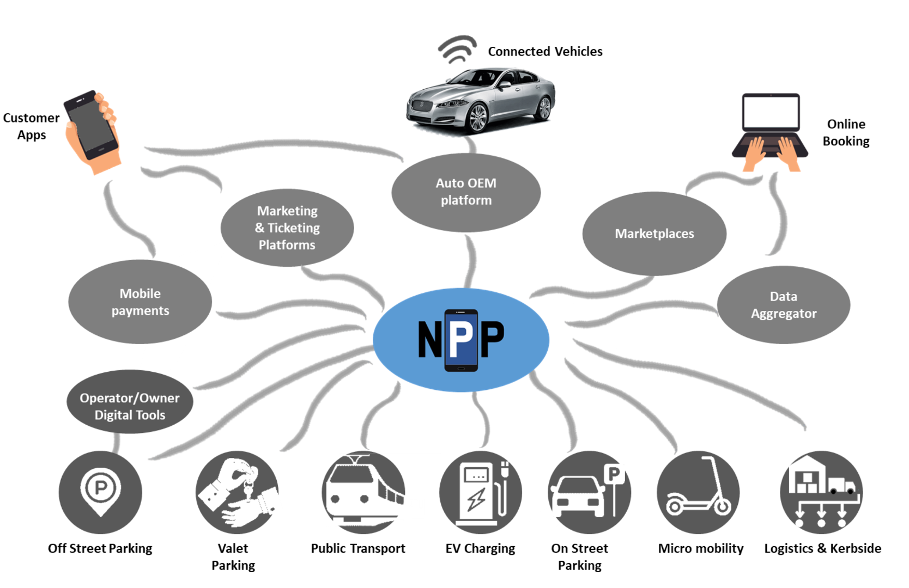

    

# National Parking Platform

## NPP – A Brief Introduction

Payment for parking is lagging behind developments in other markets and industries. Parking customers, both on-street and in car parks,  face a fragmented market offering a wide variety of payment options making the simple act of parking and paying complex and confusing as options are dependent on where they want to park and which payment app they have (or don’t have). 
The National Parking Platform (NPP) is a local authority owned and DfT funded pilot project that brings customer experience into the 21st century by facilitating data exchange, digital payments, and a new way of delivering better parking and mobility services.  
In essence, the NPP:
1.	Provides a simplified and improved customer journey from start to finish for the end-customer
2.	Creates a centralised and cost-efficient system supplying data to councils that can inform present and future strategic decisions
3.	Enables a competitive, innovative market by allowing systems to communicate with each other via open data standards and interfaces (APDS/ISO TS 5206-1)

Project Documentation

## Vision

> ### National Parking Platform
> A publicly owned, national facility that enables Parking Operators (public and private) to communicate digitally with Service Providers.

This has been the vision driving the NPP pilot project. 

## Concept
The Platform is open to all Operators and Service Providers, enabling them to exchange the full range of parking information using APDS (ISO) standard interfaces. 

Operators will be able to:
* Describe the parking they offer (including rates, times, restrictions etc) 
* Publicise occupancy in real time
* Accept payments and reservations from Service Providers without the need for a contract with each one
* Digitise compliance monitoring without the need for local digital infrastructure

Service Providers will be able to:
* Offer their customers the ability to park in any participating Operator’s facility
* Pay Operators for parking used by their Customers without the need for a contract with each one
* Negotiate rates and access with Operators for their Customers
* Reserve spaces in Operator’s facilities
* Develop value added services (e.g. guidance to space, frictionless parking) based on standard, available information.

## Mission
The project's mission was to implement a working prototype system allowing to explore the above using real actors and their data. The solution is based on a standard specification issued by the **Alliance for Parking Data Standards (APDS)**. Details on the standard and the _Alliance_ can be found here: 

.

## The Role of the NPP

## The Customer Journey

## Project Partners
The **NPP Pilot** started out as a joint project with [Manchester City Council](https://www.manchester.gov.uk), [DfT](https://www.gov.uk/government/organisations/department-for-transport) and [Parking Matters](https://parkingmatters.com). Over the time, numerous additional partners joined. You can find an overview [here](https://npp-uk.org/phases.html#current-status).

## Resources
This site provides deeper insight into the details of the NPP pilot project.

