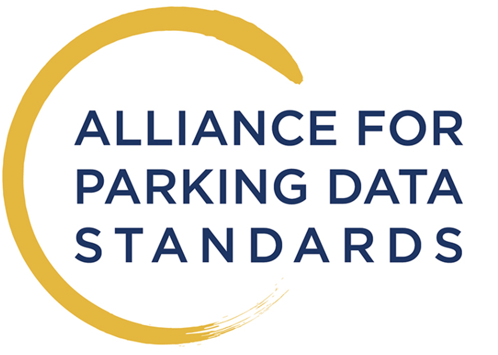

# National Parking Platform
[Vision]
```note
A publicly owned, national facility that enables Parking Operators (public and private) to communicate digitally with Service Providers.
```
This has been the vision driving the NPP pilot project. 

## Concept
The Platform is open to all Operators and Service Providers, enabling them to exchange the full range of parking information using APDS (ISO) standard interfaces. 


Operators will be able to:
* Describe the parking they offer (including rates, times, restrictions etc) 
* Publicise occupancy in real time
* Accept payments and reservations from Service Providers without the need for a contract with each one
* Digitise compliance monitoring without the need for local digital infrastructure

Service Providers will be able to:
* Offer their customers the ability to park in any participating Operator’s facility
* Pay Operators for parking used by their Customers without the need for a contract with each one
* Negotiate rates and access with Operators for their Customers
* Reserve spaces in Operator’s facilities
* Develop value added services (e.g. guidance to space, frictionless parking) based on standard, available information.

## Mission
The project's mission was to implement a working prototype system allowing to explore the above using real actors and their data. The solution was supposed to be based on a standard specification issued by the **Alliance for Parking Data Standards (APDS)**. Details on the standard and the _Alliance_ can be found here: 

[](https://www.allianceforparkingdatastandards.org).

## Resources
This site provides deeper insight into the details of the NPP pilot project.

&copy; 2022 Parking Matters Limited
