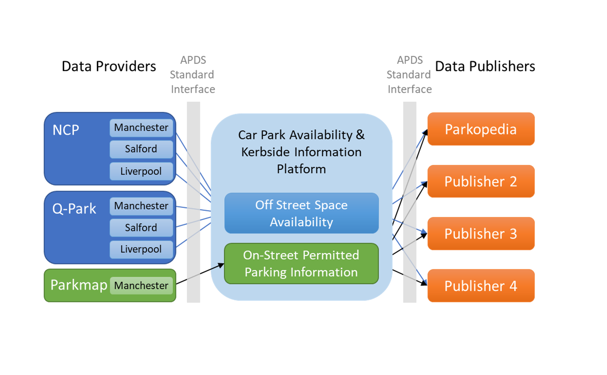
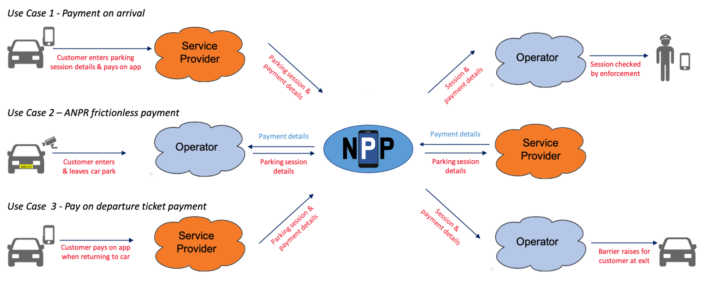
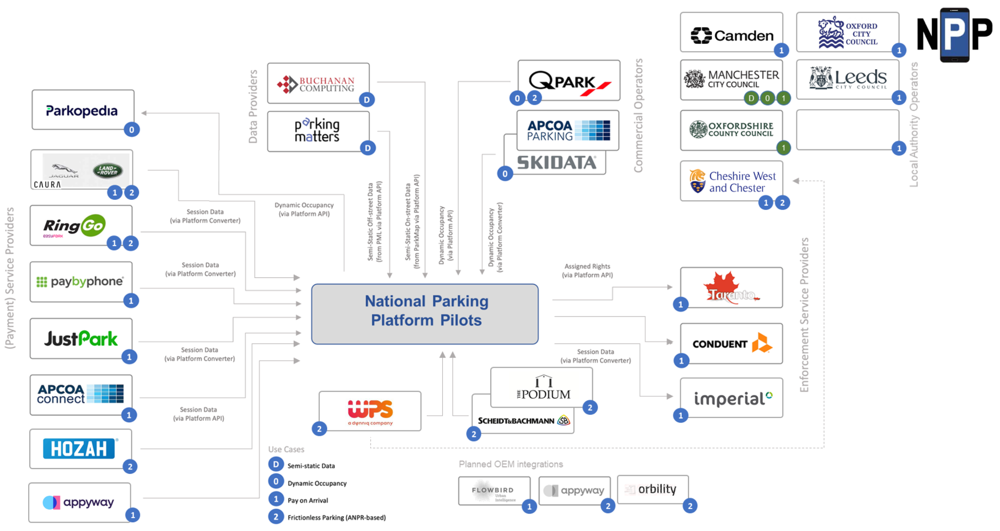

# NPP Project Phases 
The NPP project started in 2019 and has extended over a total of 3 phases.

 
## Phase 1: Offstreet Car Park and Kerbside Availability
Phase 1, completed at the end of 2019, demonstrated the potential for a platform based on APDS standards.   
 
Off street providers (NCP and Q-Park) provided data on occupancy in their Manchester, Salford and Liverpool multi-storey car parks.  

Manchester City Council provided data direct from their ParkMap TRO database, providing a list of all on-street parking in the City including restrictions and tariffs.

This data was made available on a set of standard APDS compliant APIs, which were used by Parkopedia to enhance the data in their system.

The data is available to other potential publishers. 

This platform was aimed at improving the customer journey. enabling a 'Service Provider' to guide a customer to suitable, available parking in real time:

 
 
## Phase 2: Multi-Vendor Payment
Phase 2 implemented new use cases aiming at an improved **Customer Journey**.

Three use cases were identified, in addition to the original availability use case:

 
 
## Phase 3: Go National
The first two phases of the NPP pilot project have been a success. They proved the feasibility of the general NPP concept as well as the applicability of the APDS standard for this purpose. In order to not stop there, it was agreed to extend the pilot phase and bring additional operators and service providers on board. This extended pilot will provide mid-term empirical data and also keep the system running until a potential beta/production-grade system will take over.
 
 
## Pilot Partners (Current Status)

 
