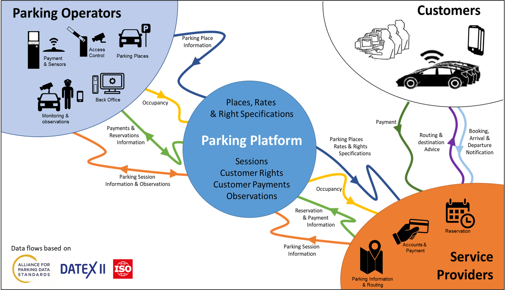

## Concept
The Platform is open to all Operators and Service Providers, enabling them to exchange the full range of parking information using APDS (ISO) standard interfaces. 

Operators are able to:
* Describe the parking they offer (including rates, times, restrictions etc) 
* Publicise occupancy in real time
* Accept payments and reservations from Service Providers without the need for a contract with each one
* Digitise compliance monitoring without the need for local digital infrastructure

Service Providers are able to:
* Offer their customers the ability to park in any participating Operator’s facility
* Pay Operators for parking used by their Customers without the need for a contract with each one
* Negotiate rates and access with Operators for their Customers
* Reserve spaces in Operator’s facilities
* Develop value added services (e.g. guidance to space, frictionless parking) based on standard, available information.

## Mission
The Pilot's mission is to implement a working prototype system allowing to explore the above using real actors and their data. The solution is based on a standard specification issued by the **Alliance for Parking Data Standards (APDS)**. Details on the standard and the _Alliance_ can be found here: 

.

## Project Partners
The **NPP Pilot** started out as a joint project with [Manchester City Council](https://www.manchester.gov.uk), [DfT](https://www.gov.uk/government/organisations/department-for-transport) and [Parking Matters](https://parkingmatters.com). Over the time, numerous additional partners joined. You can find an overview [here](https://docs.npp.org.uk/phases.html#current-status).

## Resources
This site provides deeper insight into the details of the NPP pilot project.
