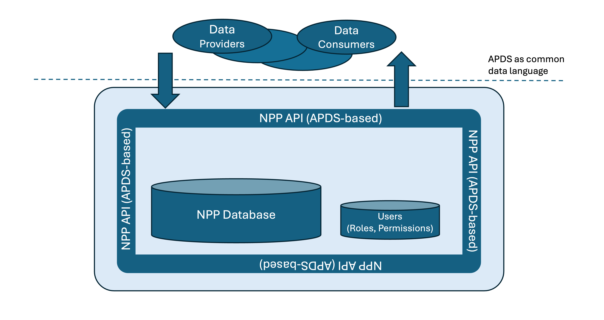

## The Principle 
The NPP essentially is a central database receiving and providing data based on registered user roles and permissions.  

The system resides in the Google Cloud Platform (GCP) environment.  

Users use an APDS-based API to talk to the NPP.  

## Data Categories
There are three different categories of information stored in the NPP:
* __Inventory Information__: location data, charging hours, eligibility information, tariffs (optionally also dynamic occupancy data). APDS domains: __PLACE__, __RIGHT SPECIFICATIONS__, __RATES__
* __Parking Right and Session Data__: issued parking rights and session information. APDS domains: __SESSION__, __ASSIGNED RIGHTS__
* __Reconciliation Information__: financial information required for the monthly reconciliation process (this part of the API is not defined by APDS, it is project specific)

## Headless Architecture
The NPP is widely a so-called headless system, i.e. it sits in the background receiving and providing data, talking to other server systems.  
Currently, only the _Session Viewer_ application is offered to human users. In the future, an _Admin Interface_ for managing inventory information might be added.

## "Dumb" by Design 
The NPP is deliberately "dumb". It is not meant to replace any of the connected systems, and it focuses on the collection and exchange of data. For example, the NPP dies not provide a rate engine calculating the amount motorists have to pay. It merely provides the input data for this process. The same applies to the orchestration of complex processes (this has to be covered by other systems connected to the NPP). In this way, the NPP acts as an intermediary / facilitator.

 

