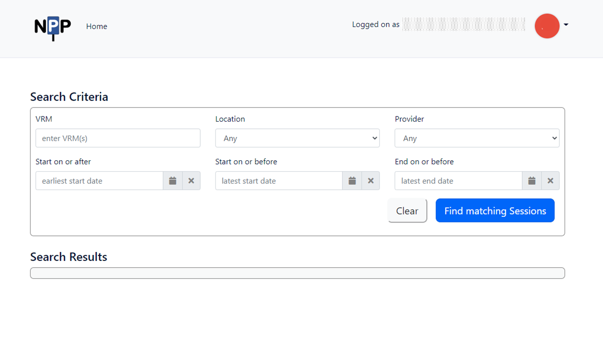
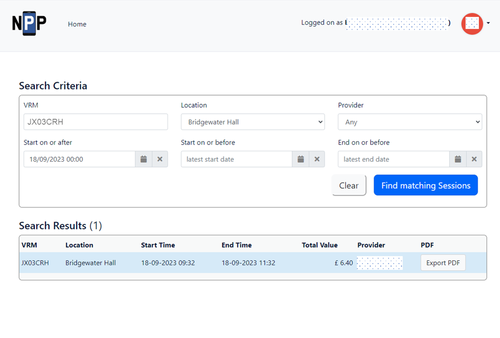
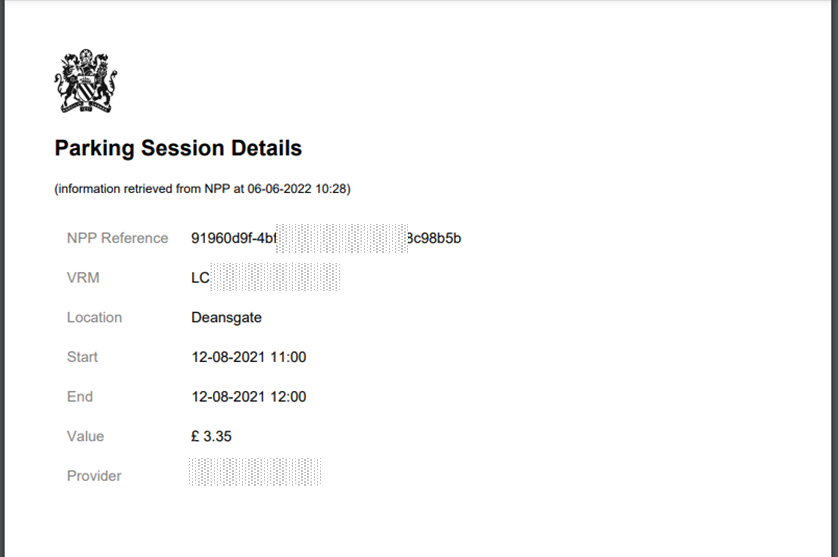

The Session Viewer is a web based tool that a parking operator can use to view any of their own parking sessions on the NPP.  The tool allows sessions from all Service Providers to be viewed together, removing the need to log into each Service Provider's system.

Each operator is provided with a 'super user' that enables them to create and manage logins for their own staff.  

## Search Tool
The Session Viewer Search Tool enables the user to identify specific sessions based on a number of criteria:

## Search Results
The Session Viewer shows all results from the search (max 1000 records):

Note: details are of a live test session.

## Individual Session Record
A single result can be downloaded as a pdf (e.g. to be attached to a PCN record):

 
