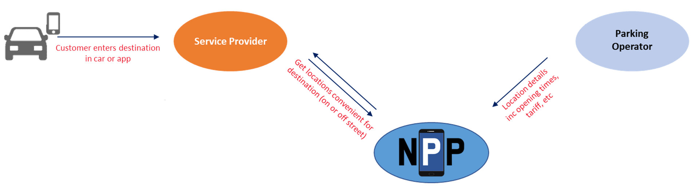
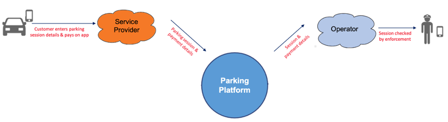
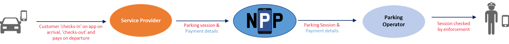
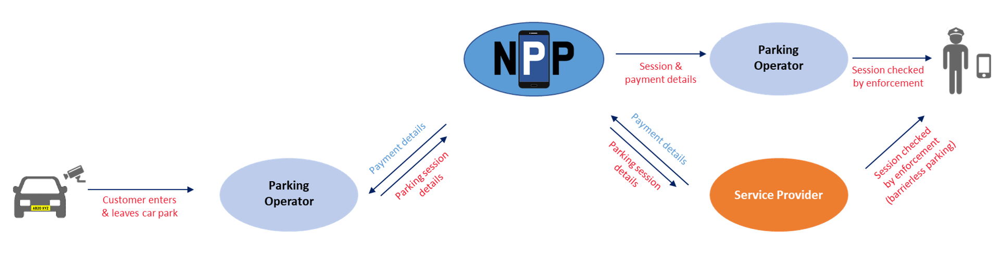
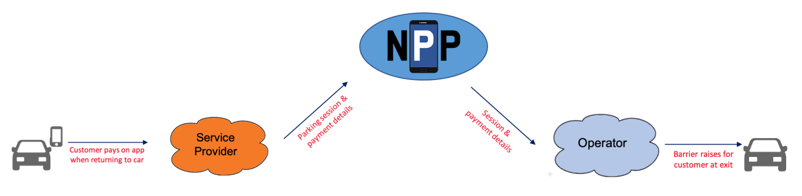

# Pilot Use Cases Overview
This document provides an overview of the use cases implemented during the various phases of the _National Parking Platform_ pilot project. Software developers implementing such flows, detailed examples can be found [here](flows.md).

## Use Case 1: Availability
This first use case was introduced in phase 1 of the product. It provided a central repository with both, (semi-)static and dynamic parking availability information. Data consumers can find available parking locations (on-street and off-street), check their details as well as current space availability.

## Use Case 2: Payment on Arrival
The first use case introduced in phase 2 of the project was _Payment on Arrival_. Besides the parking end customer, the use case involves two platform users: the pay-by-mobile service provider and the enforcement service provider contracted by the operator.

### Part 1: Parking
A customer (driver) arrives at the car park / parking area and parks his car. He then opens the mobile application provided by his service provider and enters/confirms relevant information:

* location (often automatically determined by the app)
* license plate number of his vehicle
* expected duration of stay, alternatively: expected time of leaving the car park 
* payment details

Using the provider application, the customer pays the amount due. He has now successfully purchased a right to park here, and a corresponding parking session has been created. The service provider’s system sends the details of this parking session (including payment information) to the platform.

### Part 2: Enforcement
An enforcement service officer sees the customer’s parked car and wants to check the legitimacy of this parking sessions. Using a handheld device, he types in the license plate number of the parked vehicle. The enforcement system then sends a search request to the platform (including location information and the license plate number). The platform will do a look-up and return all matching data or the information that no data could be found. 

Alternative process: if the enforcement service provider’s IT system has the capability to temporarily store parking session information, a corresponding subscription for parking session data can be registered. The platform will then pro-actively send all new session information for a particular car park / parking area to the enforcement system backend.

## Use Case 3: Payment on Check-out
The Pay on check out model enables a customer to log when they park and when they leave.  This can be used at the same locations as 'payment on arrival', the enforcement system will show that a parking session is in progress.

## Use Case 4: Frictionless Payment

## Use Case 5: Pay on Departure Ticket Payment

Note - use case numbers were changed on 27th June 2023
